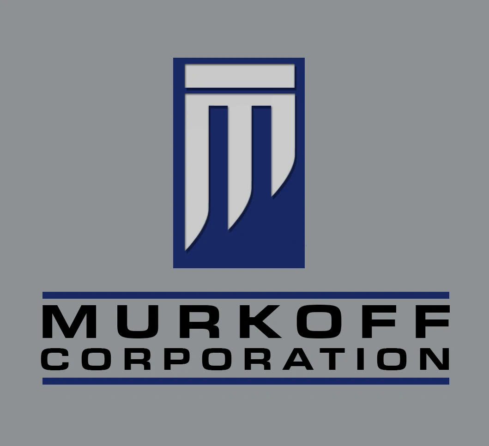

<h1 align="center"> Trường đại học Công nghệ thành phố Hồ Chí Minh  
    Đồ án Chuyên ngành - 
    Ứng dụng Android hỗ trợ bệnh nhân đăng ký khám bệnh 
</h1>

<h1 align ="center"> Chào mừng đến với Murkoff Corporation</h1>

    

# [**Lời mở đầu**](#lời-mở-đầu)

Tên nhóm : MURKOFF
Thành viên nhóm:
|STT|Tên|MSVV|
|---|---|----|
|1|Nguyễn Quốc Anh Quân|2180609238|
|2|Phạm Bạch An Duy|2180609186|
|3|Nông Thị Thu Hoài|2180609204|

Đồ án gồm :
* [**API**](#)
* [**WEB**]()
* [**Ứng dụng Android**](https://github.com/duypham666/DACN_MURKOFF_CARE_ANDROID)

Mô tả sơ lược đồ án:
**API** : 
- Là cầu nối giúp giao tiếp giữa Ứng dụng Android, WEB và Server
- Cung cấp các dịch vụ, tài nguyên và thao tác xử lý dữ liệu từ server
- Xử lý các thao tác từ Android và Web
- Công nghệ sử dụng: RESTful API, JWT (Token Authentication) 

**WEB**:
- Website được thiết kế dành riêng cho quản trị viên (admin) để quản lý hệ thống

**ANDROID**
- Ứng dụng dành cho khách hàng để sử dụng các dịch vụ như đặt lịch khám và theo dõi khám bệnh
- Công nghệ sử dụng: Android SDK, Retrofit để gọi API
